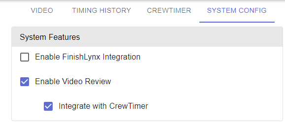
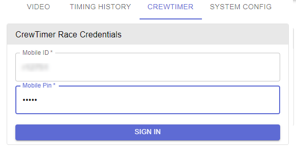
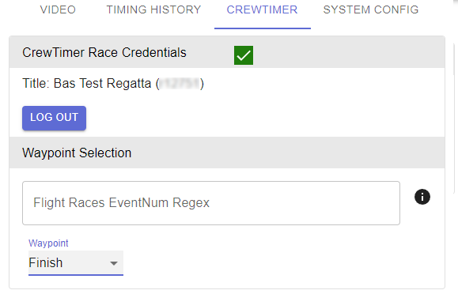
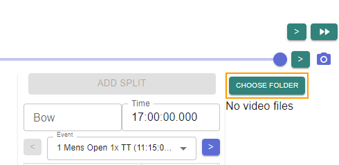
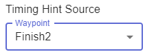

# Video processing with CrewTimer Connect

## Introduction

The CrewTimer Connect module provides the ability to process finish line recordings in a format created by CrewTimer Recorder or RiaB Camera. These recordings combine video and timestamps for accurate evaluation of the finishes. 

CrewTimer Connect makes processing the results highly efficient by integrating "hints" from other CrewTimer stations into the Workflow.

It's strongly recommended to test the full suite of hardware, software and volunteers before your actual regatta. Although the overall process is not complicated, it's more involved then operating a clicker.

## Getting started

You will need to download and installed the CrewTimer Connect software from here (Windows, Mac). These links will always take you to the latest version available. It's recommended you update the software as part of the preparation for your regatta.

You can determine the current version you are running by clicking the three lines at the top right of your Connect window -> About. A window will show you the current version.

## Configuration

There is a few setups steps to complete before you can process results. You will need to complete these steps before each regatta.

You will need the regattas **MobileID** and **MobilePIN** from the administration website.

### Associating with the correct CrewTimer regatta

If you are familiar with the CrewTimer phone app, this is going to be very familiar. 

- [ ] Select the "SYSTEM CONFIG" tab in the main Connect window
- [ ] Check the "Enable Video Review" option
- [ ] Check the "Integrate with CrewTimer" option

Below is the most common setup, your setup should now look like the below:

Before you can complete the next steps, work with your CrewTimer regatta administrator to get the MobileID and MobilePIN. Also make sure that you have both **Finish** and **Finish2** setup. CrewTimer Connect works in the same way as any other timing station. But using the **Finish** and **Finish2** names provides some additional functionality for review in the [admin portal](https://admin.crewtimer.com/).

If you are confident about your video setup, it's recommended that the video system is your primary (most accurate) source of timing.

- [ ] Select the "CREWTIMER" tab in the main Connect window
- [ ] Enter your MobileID and MobilePin for the regatta

- [ ] Press the "SIGN IN" button (a stable internet connection is an important requirement)

If all goes well you should see the name of the regatta and a green checkbox appear to indicate you have properly logged into the regatta.

Select the "Waypoint" this station will be populating results for. As mentioned earlier, the video station should be your most accurate station and probably be assigned the "Finish" Waypoint:

### Selecting the video directory

Before you can use the video review features, you need to let the software know where the video files can be found. The software will monitor this directory for any new files. When a new file is generated by the capture software, the file will automatically be added to the file list.

- [ ] Select the "VIDEO" tab in the main Connect window
- [ ] Select the "CHOOSE FOLDER" button in the top right corner of the interface

- [ ] In the folder explorer that now open, browse to the directory that will contain the video file

Your UI will now update with any files that exist in the directory you selected. It's fine if there is no files yet.

### Other setup

You have a few other options to review that can help you process your results faster. 

- [ ] In the top right corner, select the "three lines" icon -> "Video Settings" 

The first things you will want to change is the "Timing Hint Source". This fantastic feature will help you locate crews crossing the line much faster. If another volunteer is using CrewTimer with station "Finish2", select that station from the dropdown :

The default selection of "Visible Panels" is probably fine for most purposes.

If you are reviewing the video in a different timezone then where the regatta is, you can set the "Course Timezone" to where the event is taking place. This will ensure that timestamps are shown in the local timezone for where the event takes place. This is very convenient when you are for example looking at the times on a race schedule or heat sheet.

The remaining options allow you to control whether lane lines are visible in the scoring user interface.

The User Interface section below provides more detail on it's usage.