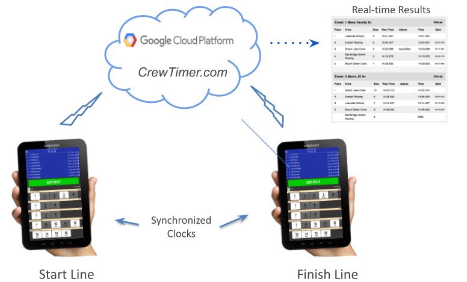
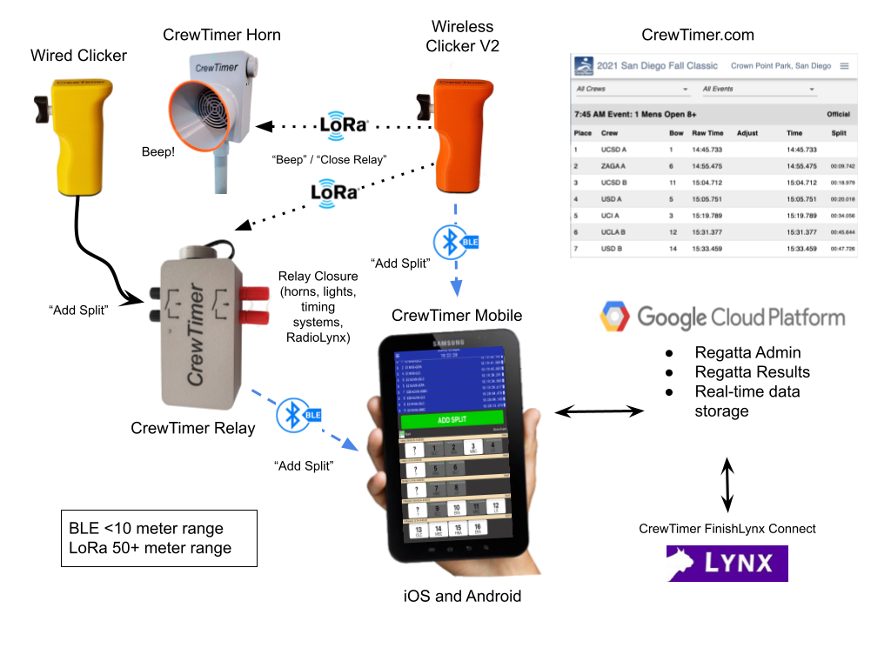

# About CrewTimer

## Simplified Architecture

## Introduction

CrewTimer utilizes affordable Android and iOS tablets (or phones) for recording start and finish times at the press of a button on screen or by pressing a companion bluetooth clicker.  It works equally well with phones.

- Timing is based on the precise timing provided by government time serviers so time synchronization of tablets is inherently part of the architecure.
- Time events are instantly communicated to the CrewTimer cloud server built on the Google Cloud Platform to provide scalability and capacity to many simultaneous users.
- Results are available from the CrewTimer.com website as timing events are created.

## Getting Started

If you are a regatta organizer or would like more details about CrewTimer, please visit the [CrewTimer Administration Site](https://admin.crewtimer.com/help) to get started using CrewTimer.

## Full Architecture Overview

