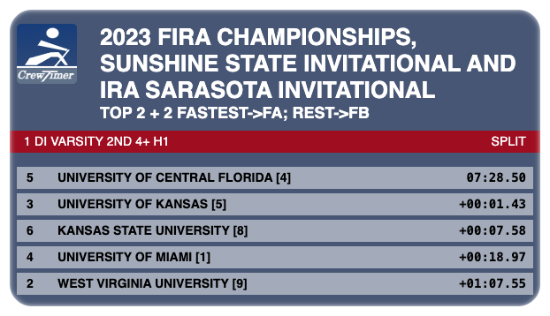

# CrewTimer Livestream Overlay

On this page:
<!-- TOC -->

- [CrewTimer Livestream Overlay](#crewtimer-livestream-overlay)
  - [Introduction](#introduction)
  - [Event Navigation](#event-navigation)
  - [URL Arguments](#url-arguments)
  - [Testing your URL arguments](#testing-your-url-arguments)
  - [Integrating with OBS](#integrating-with-obs)
  - [Integrating with vMix](#integrating-with-vmix)
  - [Legacy Livestream Support](#legacy-livestream-support)

<!-- /TOC -->
<!-- /TOC -->

## Introduction

The CrewTimer Livestream Overlay provides a simple way to create real-time information overlays for use with live streaming your regatta.  It integrates directly with popular tools such as OBS and vMix without the need for chroma keys.

To get started, simply use a url of the following form:

<https://crewtimer.com/live/r12071> Where r12071 is replaced with your Regatta ID.

Many features of the overlay are customizable via [URL Arguments](#url-arguments).  By using different sets of URL arguments you can have a set of preconfigured overlays at your fingertips.

For example, the starting lineups are available by simply using the waypoint=start url argument:

<https://crewtimer.com/live/r12071?waypoint=start>

While the overlay is targeted to overlay of livestream video, it can also be used as an informational display on large monitors by selecting the kiosk=true option.

## Event Navigation

There are two hotspots on the overlay that can be clicked to move to the next or prior race.  Clicking on the left side of the separator bar moves to the prior race while clicking on the right side moves to the next race.

A second way to navigate events is to click on the Title area of the overlay.  This will place a drop-down selector to allow selecting an event.  Be careful however as the drop-down may overlay your video and be visible in your livestream depending on your crop factors.  This can be useful to navigate when the overlay is not visible.  If the title disabled (showTitle=false), click on the blank area at the top of livestream graphic to show the drop-down.

## URL Arguments

The presentation of the live stream summary can be customized by appending parameters to the URL.  URL parameters are specified by preceding the first parameter with a question mark symbol and separating additional arguments with the the ampersand symbol.

For example, <https://crewtimer.com/live/r12071?waypoint=finish&width=600px>

Colors can be specified with any css supported color specification.  When using hexadecimal RGB or RGBA, the # character can be left off the color or it can be inserted by using a url encoded # character.  e.g. '%2300ff00' or '00ff00' for green

| Parameter   | Default value                    | Description                                                                                                                                                                                                                                                                                                                 |
| ----------- | -------------------------------- | --------------------------------------------------------------------------------------------------------------------------------------------------------------------------------------------------------------------------------------------------------------------------------------------------------------------------- |
| waypoint    | waypoint=finish                  | When 'start' is selected only the lineups are shown.  When finish is selected finish times are shown as they come in. If 'hide finish times till official' is selected in the regatta configuration then the times are not shown until the race is marked as Official. Other waypoints will show times as they come in.  |
| width       | width=600px                      | The width of the content window                                                                                                                                                                                                                                                                                             |
| align       | align=bottom                     | Specify the vertical alignment on the page.  Can be one of 'top', 'center', or 'bottom'. Bottom alignment fixes the bottom of the overly a in a fixed position allowing the bottom to grow.  This is handy for positioning on the bottom of the video channel.  If your preference is for top of screen, specify align=top. |
| kiosk       | kiosk=false                      | Automate the changing of the selected event.  The last event with a start or finish time applied will be selected.                                                                                                                                                                                                          |
| bg          | bg=rgba(27,49,93,0.80)           | Set the background of the content window. If a page-bg settig other than none or transparent is configured, the color becomes rgba(27,49,93,1.0)                                                                                                                                                                            |
| showTime    | showTime=false                   | True to show the total elapsed instead of split timing                                                                                                                                                                                                                                                                      |
| borderRadius | borderRadius=20px                | Set the size of the border radius.  Use borderRadius=0px for a square shape                                                                                                                                                                                                                                                |
| page-bg     | page-bg=none, page-bg=ff00ff     | Set the background color of the containing page.                                                                                                                                                                                                                                                                            |
| bar-bg      | bar-bg=rgba(167,28,32,100)       | Set the color of the bar separating the title area and the race linesups                                                                                                                                                                                                                                                    |
| showBody    | showBody=true                        | Show or hide the body of the content window.                                                                                                                                                                                                                                                                                |
| showElapsed    | showElapsed=true                        | Show an elapsed timer when an event is underway.  If showTime=true then it shows total elapsed event time.  If showTime=false then it shows a split time from the first to finish. For [just a bar with the elapsed time](https://crewtimer.com/live/r12071?showTitle=false&showBody=false&bg=transparent), use showTitle=false&showBody=false&bg=transparent as URL arguments. |
| showTitle   | showTitle=true                       | Show or hide the title section of the content window.                                                                                                                                                                                                                                                                       |
| showLogo    | showLogo=true                        | Show or hide the logo in the content window.                                                                                                                                                                                                                                                                                |
| showCrew    | showCrew=true                    | Show or hide the Crew name.                                                                                                                                                                                                                                                                                                 |
| showStroke  | showStroke=false                 | Show or hide the Stroke Name.                                                                                                                                                                                                                                                                                               |
| title-color | title-color=ffffff                | Set the color of the title text.                                                                                                                                                                                                                                                                                            |
| fontSize    | fontSize=14px or fontSize=0.9em  | Adjust the font size for entries and times.                                                                                                                                                                                                                                                                                           |
| titleFontSize    | titleFontSize=26px or titleFontSize=0.9em  | Adjust the font size for main title.                                                                                                                                                                                                                                                                              |
| subtitleFontSize | subtitleFontSize=18px or subtitleFontSize=0.7em  | Adjust the font size for subtitle text.                                                                                                                                                                                                                                                                                |
| eventNum    | eventNum=27                      | Start by showing a specific event. The event can still be changed by pressing the prev and next area of the separating bar.                                                                                                                                                                                                 |
| title       | title=Glactic Rowing Finals 2100 | Title to show instead of the Regatta Title                                                                                                                                                                                                                                                                                  |
| subitle     | subtitle=Hosted by Klingons      | Subtitle to show instead of event InfoText                                                                                                                                                                                                                                                                                  |

## Testing your URL arguments

You can use any CrewTimer regatta ID to test your URL arguments before race day.  The regatta ID r12071 has been setup to show races in various stages such as not started, started, partial finishes, and official.

**Be sure to only include the question mark before the first argument and use ampersand between all subsequent arguments.**  Using question mark twice will cause some arguments to be ignored.

## Integrating with OBS

OBS, which stands for [Open Broadcaster Software](https://obsproject.com/), is a free and open-source software suite for video recording and live streaming. It is widely used by gamers, content creators, and professionals for broadcasting to platforms like Twitch, YouTube, and Facebook Live.

1. Using an existing Scene, click + button under sources and choose browser.
2. For the URL, use a live url such as <https://crewtimer.com/live/r12071>
3. Place and resize the overlay on your video.
4. Optionally click a 'interact' button below the scene preview (with browser source highlighted).  This pops up a mini browser window and allows you to click to go to the next event.

## Integrating with vMix

[vMix](https://www.vmix.com/) is a versatile and powerful live video production software solution that allows users to create professional-quality live streaming and video productions. It is widely used by broadcasters, live event producers, churches, and content creators for its extensive features and flexibility.

1. Select Add Input
2. Select Web Browser Input Tab
3. Enter the regatta URL:  <https://crewtimer.com/live/r12071>, then OK.
4. Click on the new input tile to show in the large Preview Window
5. To enable it to overlay, click one of the overlay channel numbers below the input tile.

The position and size can be done two ways (at least)

1. Click on the gear icon (upper right) of the preview window and move the overlay to the position you wish. By default it is centered.  Select the Position tab and drag it around.  It has a bit of transparency already but it can be increased by selecting Color Adjust and changing the Alpha.
2. Customize the overlay channel - Scale, alpha, position, etc.  Click the Overlay tab at the bottom of the screen.  [This video](https://www.youtube.com/watch?v=_reWidnfzl0&t=0s) has a walkthrough.

## Legacy Livestream Support

Prior versions of CrewTimer supported kiosk and livestreaming by allowing customization of the existing CrewTimer views.  This option is still available and is described in the [Legacy Livestream Support](https://crewtimer.com/help/LegacyLivestream) page.
