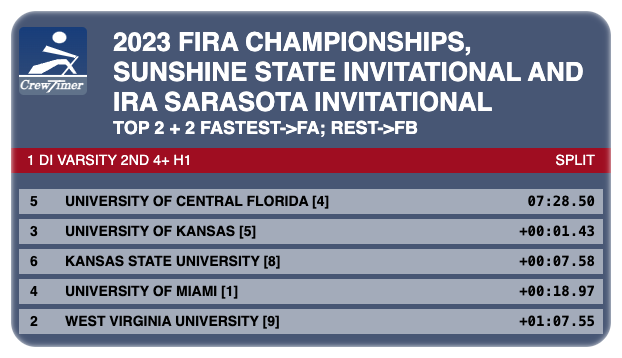

# CrewTimer Livestream Overlay

On this page:
<!-- TOC -->

- [CrewTimer Livestream Overlay](#crewtimer-livestream-overlay)
  - [Introduction](#introduction)
  - [Opening the Livestream Dashboard](#opening-the-livestream-dashboard)
  - [Staging and Transitioning an Overlay](#staging-and-transitioning-an-overlay)
  - [Race Selection and Viewer Navigation](#race-selection-and-viewer-navigation)
  - [Default Configuration](#default-configuration)
  - [Presets](#presets)
  - [Remote Livestream Control](#remote-livestream-control)
  - [Display Modes](#display-modes)
    - [All Entries](#all-entries)
    - [Leaderboard](#leaderboard)
  - [Overlay Appearance and Content](#overlay-appearance-and-content)
  - [Event Navigation in the Livestream View](#event-navigation-in-the-livestream-view)
  - [URL Arguments](#url-arguments)
  - [Testing Your Configuration](#testing-your-configuration)
  - [Integrating with OBS](#integrating-with-obs)
  - [Integrating with vMix](#integrating-with-vmix)
  - [Legacy Livestream Support](#legacy-livestream-support)

<!-- /TOC -->

## Introduction

The CrewTimer Livestream Overlay provides real-time regatta information for video productions. It can be added directly to OBS, vMix, or another production system as a browser source; a chroma key is not required.

The overlay URL has the following form, with `r12071` replaced by your regatta ID:

<https://crewtimer.com/live/r12071>

The Livestream Dashboard is the recommended way to configure and operate the overlay. Changes are staged in a private control preview before being transitioned to the live overlay. URL arguments remain available for advanced configurations and compatibility with existing browser-source URLs.

You can explore the controls using the [r12071 demonstration Livestream Dashboard](https://admin.crewtimer.com/live-control/r12071/d8b46fb0-ff3f-4d1e-b3e2-81296bb41baa). The demonstration regatta is reset every 30 minutes on the hour and half hour.

## Opening the Livestream Dashboard

1. Sign in to CrewTimer Race Admin.
2. Open the regatta.
3. Select **Configure Livestream**.

The dashboard opens in a new browser tab so Race Admin remains available in the original tab.

The top of the dashboard contains three areas:

- **Race and configuration controls** select the race, display mode, waypoint, presets, and remote access.
- **Control preview** displays staged changes that are not yet live.
- **Remote preview** displays the configuration currently used by the live overlay.

Use the preview-size button in the upper-right corner of either preview to switch between a scaled 1920×1080 program view and an actual-size overlay view.

The **Open in Browser** link opens the production overlay URL in another tab. Use this URL as the browser source in your production software.

## Staging and Transitioning an Overlay

Dashboard edits are staged. They immediately appear in the **Control preview**, but do not change the live overlay.

When the staged overlay is ready, select **Transition**. The complete staged configuration is written to the live overlay, and the **Remote preview** updates to match it. This workflow lets an operator prepare a race, waypoint, layout, or graphic without changing what viewers currently see.

The **Show overlay content** checkbox can be staged and transitioned like any other setting. Clear it and transition to remove the graphic from the live view; select it and transition to restore the graphic.

## Race Selection and Viewer Navigation

The Race selector has two operating modes:

- Select a specific race to pin the live overlay to that race. Use **Prev** and **Next** in the dashboard to stage adjacent races, then select **Transition** to put the selected race on air.
- Select **Viewer navigation** to leave the race unpinned. After transition, navigation in the livestream browser controls the displayed race.

A race supplied directly in the overlay URL with `eventNum` has the highest priority and remains pinned by that URL. Kiosk mode can also select the race automatically.

## Default Configuration

Select **Default** to reset the staged controls to CrewTimer's standard livestream appearance and behavior. This affects only the staged Control preview until **Transition** is selected.

The default configuration includes:

- Viewer navigation instead of a remotely pinned race
- Finish waypoint
- All Entries display
- Bottom alignment
- CrewTimer's standard colors, sizes, title area, and entry columns
- Overlay, title, body, logo, event name, crew, and elapsed-time display enabled
- Stroke/cox, absolute time, and kiosk mode disabled

If **Default** is selected and transitioned without further changes, the remote race pin is cleared. The livestream view can then use its previous/next navigation again.

## Presets

Presets store reusable appearance and content configurations. A preset does not store the selected race, allowing the same graphic to be recalled for any race.

To save a preset:

1. Stage the desired configuration.
2. Enter a name in **Preset name**.
3. Select **Save**.

Selecting a preset recalls it into the staged Control preview while retaining the currently selected race. Select **Transition** when it is ready to go live. Saving another preset with the same name replaces the existing preset. Use the delete button next to a preset to remove it.

## Remote Livestream Control

The **Enable Live Config Link** feature creates a credentialed dashboard link for a remote livestream operator. The operator can stage and transition overlays without receiving access to the rest of Race Admin.

To enable remote control:

1. Select **Enable Live Config Link**.
2. Select **Copy Live Config Link**.
3. Send the copied link to the livestream operator through a secure channel.

The link provides access to the livestream configuration for this regatta. Treat it as a credential and share it only with the intended operator.

To revoke access, clear **Enable Live Config Link**. The existing link immediately becomes invalid. Enabling the feature again creates a new link, so an older link remains invalid.

The remote dashboard validates its link when opened. If validation fails because of a temporary network problem, it offers a retry action. A revoked or incorrect link is reported as invalid.

## Display Modes

### All Entries

**All Entries** displays every entry for the selected race and waypoint. At Start it acts as a start list. At Finish or another timing waypoint it displays results in time order.

### Leaderboard

**Leaderboard** limits the overlay to the number entered in **Leaderboard entries**.

Entries are ranked using the selected waypoint's result time:

- Start uses `S_time`.
- Finish uses `RawTime`.
- Other waypoints use `G_<waypoint>_time`.

The most recent entry to receive a result is always kept visible. If it is outside the first N places, it replaces the Nth displayed row. Its place remains its position in the complete waypoint ranking rather than its displayed row number. For example, a two-row leaderboard may show `1st` and `5th`.

Place is shown for Finish and intermediate waypoints and omitted for Start. Bow numbers use a `#` prefix. When the Nth displayed entry changes, the replacement row slides into view. The animation is disabled for viewers who request reduced motion in their operating-system or browser settings.

Leaderboard mode uses the CrewTimer logo by default. An uploaded replacement logo takes precedence.

## Overlay Appearance and Content

The lower portion of the dashboard controls the overlay's layout and content:

- **Vertical alignment** positions the overlay at the top, center, or bottom of the browser source.
- **Title** and **Subtitle** override the regatta title and event description. Blank values use the corresponding regatta data. If the displayed subtitle is empty, the logo is reduced and the title is centered beside it.
- **Overlay width**, body font size, title font size, subtitle font size, and border radius accept CSS sizes such as `600px` or `1em`.
- **Page background**, overlay background, bar background, and title color accept CSS colors. Each color control also provides an opacity slider.
- Content checkboxes control the title area, entry body, logo, event name, elapsed time, absolute time, crew, stroke/cox, and kiosk behavior.
- **Replacement logo** uploads a custom image for this overlay. Remove it to return to the regatta or CrewTimer logo.

When **Show title area** is disabled, the race bar becomes the top edge of the overlay without an empty strip above it.

The waypoint selector includes Start, Finish, and the timing waypoints configured for the regatta.

## Event Navigation in the Livestream View

When a race is not pinned by the dashboard, URL, or kiosk mode, the livestream view supports several navigation methods:

- Press **Tab** or the **Right Arrow** to move to the next race.
- Press **Shift+Tab** or the **Left Arrow** to move to the previous race.
- Click the left side of the race bar for the previous race.
- Click the right side of the race bar for the next race.
- Click the title area to display the event selector.

The event selector may be visible in the outgoing video, depending on browser-source cropping. Use it cautiously while the overlay is live. If the title area is hidden, use keyboard or race-bar navigation.

## URL Arguments

URL arguments can override dashboard and default settings. Put `?` before the first argument and `&` between additional arguments. For example:

<https://crewtimer.com/live/r12071?waypoint=finish&width=600px>

Colors may use any CSS-supported color. For hexadecimal RGB or RGBA values, omit `#` or encode it as `%23`; for example, `00ff00` or `%2300ff00`.

| Parameter | Default | Description |
| --- | --- | --- |
| `eventNum` | blank | Pins the overlay to a specific event. Omit it to permit viewer navigation. |
| `waypoint` | `finish` | Selects `start`, `finish`, or a configured timing waypoint. |
| `displayMode` | `entries` | Selects `entries` or `leaderboard`. |
| `leaderboardSize` | `2` | Number of rows displayed in leaderboard mode. |
| `width` | `600px` | Width of the overlay content. |
| `align` | `bottom` | Vertical alignment: `top`, `center`, or `bottom`. |
| `kiosk` | `false` | Follows the most recently active event automatically. |
| `page-bg` | `none` | Background color of the browser page. |
| `bg` | `#1b315dcc` | Overlay background color. |
| `bar-bg` | `#a71c20` | Race-bar background color. |
| `title-color` | `#fff` | Title and subtitle color. |
| `showOverlay` | `true` | Shows or hides all overlay content. |
| `showTitle` | `true` | Shows or hides the title area. |
| `showBody` | `true` | Shows or hides entry rows. |
| `showLogo` | `true` | Shows or hides the logo. |
| `showEventName` | `true` | Shows or hides the event name in the race bar. |
| `showCrew` | `true` | Shows or hides crew names. |
| `showStroke` | `false` | Shows or hides stroke/cox names. |
| `showElapsed` | `true` | Shows the running elapsed value when applicable. |
| `absTime` | `false` | Shows absolute result times instead of splits. The older `showTime` name remains supported as an alias. |
| `fontSize` | `14px` | Entry and result font size. |
| `titleFontSize` | `26px` | Main title font size. |
| `subtitleFontSize` | `18px` | Subtitle font size. |
| `borderRadius` | `20px` | Overlay corner radius. Use `0px` for square corners. |
| `title` | blank | Custom title; blank uses the regatta title. |
| `subtitle` | blank | Custom subtitle; blank uses the event description. |

URL arguments take precedence over the dashboard's transitioned configuration. This is useful for dedicated browser sources, but a pinned `eventNum` or other URL override cannot be changed from the dashboard until it is removed from the source URL.

## Testing Your Configuration

The dashboard's Control preview is the safest place to test changes because staging does not affect the remote overlay. The regatta ID `r12071` can also be used to test races in several states, including not started, underway, partially finished, and official.

Open the [r12071 demonstration Livestream Dashboard](https://admin.crewtimer.com/live-control/r12071/d8b46fb0-ff3f-4d1e-b3e2-81296bb41baa) to try the remote-control workflow. Remote control is always enabled for this demonstration regatta, and its data is reset every 30 minutes on the hour and half hour.

When constructing a URL manually, include `?` only before the first argument and use `&` before every subsequent argument. A second `?` causes later arguments to be ignored.

## Integrating with OBS

[OBS](https://obsproject.com/) is free, open-source software for recording and livestream production.

1. In an existing Scene, select the **+** button under Sources and choose **Browser**.
2. Enter a CrewTimer live URL such as <https://crewtimer.com/live/r12071>.
3. Set the browser source canvas to the production resolution, commonly 1920×1080.
4. Place, resize, or crop the overlay as needed.
5. Optionally select **Interact** while the browser source is highlighted to use the overlay's click navigation.

Keep the browser-source URL free of `eventNum` if the dashboard's **Viewer navigation** mode should control whether navigation is available.

## Integrating with vMix

[vMix](https://www.vmix.com/) supports CrewTimer as a Web Browser Input.

1. Select **Add Input**.
2. Select the **Web Browser** input tab.
3. Enter a CrewTimer live URL such as <https://crewtimer.com/live/r12071>, then select **OK**.
4. Select the new input tile to display it in the Preview Window.
5. Select an overlay channel number below the input tile to put it on air.

Position and size can be adjusted in either of these ways:

1. Select the gear icon in the preview window, open the Position tab, and scale or move the overlay. The Color Adjust tab can change the input's overall alpha.
2. Customize the vMix overlay channel's scale, alpha, and position from the Overlay settings. [This video](https://www.youtube.com/watch?v=_reWidnfzl0&t=0s) provides a walkthrough.

## Legacy Livestream Support

Earlier CrewTimer versions customized the standard CrewTimer views for kiosk and livestream use. That option remains available on the [Legacy Livestream Support](https://crewtimer.com/help/LegacyLivestream) page.
