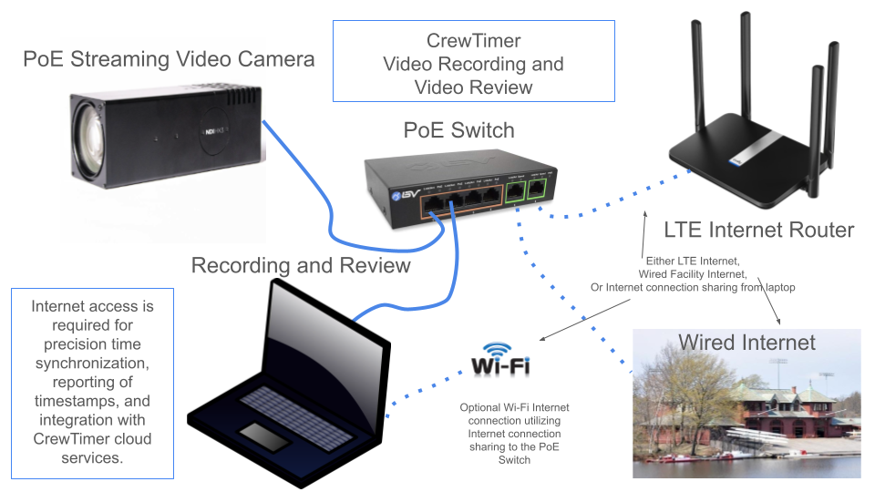

# CrewTimer Video Recorder

The CrewTimer Video Recorder app is used to record mp4 video files for use with the CrewTimer Video Review app.  It provides basic controls for controlling how video is captured, started, and stopped as well as marking the position of the finish line.

*NOTICE: This software is in it's infancy.  Please report any issues to <info@crewtimer.com>*



## Requirements

* [NDI](https://en.wikipedia.org/wiki/Network_Device_Interface ) capable video camera.  Network Device Interface (NDI) is a protocol used to provide low latency video over a 100Mbit or Gigabit computer network most commonly used in professional video production,
* Hardwired network connection between the recording computer and the NDI camera.  WiFi can drop video frames due to RF interference.
* Internet access.  Either hardwired or via a hotspot. The NDI cameras have built-in time synchronization utilizing Network Time Protocol (NTP) servers to timestamp each video frame.  If the video will only be used for finish order then Internet access is not required.
* MacOS or Windows laptop.  Generally any laptop produced after 2020 is suitable.  The least expensive laptop from Costco works.

## Installation

Download the installer from the [Downloads Page](https://crewtimer.com/help/Downloads).

## Getting Started

1. Connect your NDI camera to a network switch also connected to your recording computer.
2. Start the CrewTimer Video Recorder app.
3. Review the default settings and change output folder or file prefix if desired.
4. Press the Play button to start recording.

## Customize and adjust your camera settings

1. Using the Camera dropdown in the app, identify the IP address of your camera.
2. Connect to your camera with a web browser. e.g. <http://10.0.1.188> and log in.  Cameras often default to 'admin' as the username and 'admin' as password.
3. Configure your camera to 720p or 1080p video - 1280x720.  Use 60 fps or higher rate for the NDI video stream.  This is often a choice under an NDI configuration menu.
4. Click the Play button on the video preview area of the app.
5. Review the event log. Look for reported Gaps in the recording.  It is normal to have an initial Gap reported as the video is starting or properties are changed.  If you see gaps > 90ms you may need to get a faster computer, reduce the resolution, or use the crop function to reduce resolution.
6. Use VLC or CrewTimer Video Review to verify the video is being recorded properly.
7. Use the camera web page (see step 2) to control camera aspects such as zoom, focus, aperature, and exposure as needed.
8. Use the camera web interface presets (if available) to quickly change configurations.

## Camera Exposure

The key setting in the camera for useful video is are the exposure controls.  Often 'auto' exposure can provide good results.  If you find the 'auto' setting is over exposed or not to your satisfaction try changing the aperature setting as follows:

1. Choose 'auto' exposure to see if that is suitable.
2. Choose an aperature of F11 or greater if possible.  This increases the size of the area that will be in focus.
3. Adjust the shutter speed to give a suitable exposure.

## Adjusting Finish Line guide

A red line is drawn on the video to show the location of the finish line.  The position chosen is utilized by the Video Review app to help score the finish times for boats.  To adjust the finish line position:

* Click the pencil icon to show the drag handles
* Drag the top handle to adjust the position.  When the top handle is moved, the bottom handle moves with it.
* Drag the bottom handle to adjust only the bottom position.  This allows selecting a finish line that has a orientation other than exactly vertical.
* Press the 'move to center' icon to reset the guide to the center of the video.

## Cropping Video

Recorded video can be cropped to eliminate areas that do not provide useful context.  This results in smaller mp4 files as well as reducing overhead needed to encode the video.  If the log reports gaps, cropping the recorded video can eliminate the gaps by reducing the cpu overhead required to record.

There are two icons shown on the video to assist with cropping video:

* Pencil icon - Press to enable the crop handles.  The icon will change to a checkmark to comlplete the cropping action.
* Maximize icon - Press the maximize icon to set the cropping rectangle to maximum size.

## Internet Connectivity

NDI cameras have a NTP client built-in which sets the camera time from a network time server.  The camera then timestamps each video frame allowing applications to synchronize multiple video streams gathered separately.  For use with CrewTimer, these timestamps are used to accuratly timestamp each frame in the CrewTimer Connect app.  If internet connectivity is not present, the camera will timestamp video based on it's current notion of time.

If the only use for the video is for finish order determination, Internet connectivity is not required.  However, if the intent is to utilize the video as backup timing in additon to quickly determining finish order, an Internet connection is required.

**NOTE: Do not try to set up your Internet on regatta day for the first time.** You should test out your connectivity ahead of time and understand how your network needs to be configured.

### Hardwired Internet available

If local hardwired internet is available, simply ensure the camera network connection has access to the network.  Hardwired Internet can be from a facility LAN drop or it could be from a hotspot with RJ45 cabled network connections.  The recording computer should preferably be on the same network switch as the camera.  See the equipment list below for an example hotspot.

### Only WiFi available

If only WiFi is available, there are several configurations which can work in this situation.

1. Use a WiFi router in client mode to connect to the available WiFi.  The network ports on the WiFi router would the connect to the camera and laptop.  Many WiFi routers support this type of connectivity.  In this scenario the WiFi in the laptop should be disabled or the WiFi should be set as the preferred Internet port (see instructions below).
2. Utilize Windows Internet Connection Sharing (ICS) to share the WiFi connection with the computer wired interface.  In this scenario, connect a switch to the computer and also the camera.  The camera will obtain an IP address from the computer's ICS software and access the internet via it's WiFi connection.
3. Add your own NTP server on the camera network using a Raspberry Pi.  Use fixed IP addresses on the wired network with the camera NTP server configured to utilize your local NTP server.  The laptop will also be configured with a fixed IP address on the wired network so it can communicate with the camera and record video.  WiFi should be set as the preferred Internet port (see instructions below).

## Camera Selection

For suggested configurations, please check out the [Equipment Page](../general/Equipment.md).

All NDI capable cameras should work with CrewTimer Video Recorder.  However, some low end SMTAV cameras provide unreliable frame timing.  The following cameras have been tested and work well with CrewTimer Video Recorder.

If you find an NDI camera that works well for you please send an email to [CrewTimer](info@crewtimer.com) so it can be added to the list.

| Price | Zoom | PTZ | FPS |                                          | Verified | Model                                                                                                                                   |
| ----- | ---- | --- | --- | ---------------------------------------- | -------- | --------------------------------------------------------------------------------------------------------------------------------------- |
| $1075 | 30X  |     | 60  |   | **Yes**  | [AIDA UHD-NDI3-X30](https://a.co/d/1T1P2zE) |
| $1450 | 20X  | Yes | 120 |   | **Yes**  | [AIDA PTZ-NDI3-X20](https://usbroadcast.co/product/aida-imaging-ptz-ndi3-x20b-full-hd-ndihx2-ptz-camera-20x-zoom-black/)                |
| $719  | 30X  | Yes | 60  |  | **Yes**  | [SMTAV BX30N](https://www.smtav.com/collections/ndi/products/smtav-ai-tracking-ndi-ptz-camera-30x-optics-zoom)                          |
| $799  | 30X  | Yes | 60  |    | **Yes**  | [AVKANS NDI PTZ Camera](https://a.co/d/acMZ1qf)                                                                                         |

 **Note**:Cameras often needed software upgrades to operate properly.  Be sure to update software as soon as you purchase one.  The SMTAV BA series had unreliable NDI timestamps and are not recommended.

The SMTAV BX30N camera requires a software update to version 8.02.88 or better to properly work with DHCP.  Contact <info@smtav.com> for firmware updates.  They also have a .pkg file update to fix an issue with the Chrome browser on version 8.02.88.

## Other useful equipment

### Camera Mounting

| Item                                            | Description                                         |
| ----------------------------------------------- | --------------------------------------------------- |
| [NEEWER Tripod Head](https://amzn.to/4cq5cpn)   | Three way geared tripod head.                       |
| [Manfroto Super Clamp](https://amzn.to/4bNIYO1) | Handy to mount your camera to scaffolding or rails. |
| [SLIK Pro 700 DX](https://amzn.to/3KO2ZIP)      | Sturdy Tripod.                                      |
| [SLIK Pro CF-734](https://amzn.to/4cuixxg)      | Carbon Fiber Tripod.  Can fit in carry-on luggage   |
| [Focusing Rail](https://amzn.to/3wIi37i)        | Horizontal adjustment of camera on tripod head.     |

### Networking and Power

| Item                                                  | Description                                          |
| ----------------------------------------------------- | ---------------------------------------------------- |
| [STEAMEMO 5 Port Gigabit Ethernet Unmanaged PoE Switch](https://a.co/d/g7WprQ4) | Network switch to power camera over CAT5/6 cable.  |
| [BVTech PoE+ Gitabit Switch](https://amzn.to/3QSzwkt) | Network switch to power camera over CAT5/6 cable.  (uses AC Adapter)  |
| [LTE Router](https://amzn.to/3QMPTP9)                 | Provide local DHCP and Internet access               |
| [Micro USB PoE+](https://amzn.to/3QSqzHw)             | Power micro usb device (e.g. router) via PoE+ switch |
| [USB C PoE+](https://amzn.to/3QU2Vup)                 | Power USB C device (e.g. router) via PoE+ switch     |

## Software Tools

NDI Tools are available to help monitor test NDI video streams.  The following programs are recommended and are part of the FREE [NDI Tools](https://ndi.video/tools/) download.  Registration is required.

* [NDI Video Monitor](https://ndi.video/tools/ndi-video-monitor/) - Watch the video stream from the camera from any other device.  Display on a large monitor if desired.
* [NDI Scan Converter](https://ndi.video/tools/ndi-scan-converter/) - Play a youtube video of a regatta, capture the video with NDI Scan Converter as an NDI stream and record it with CrewTimer Recorder to test it out.
* [NDI Test Patterns](https://ndi.video/tools/ndi-test-patterns/) - No camera yet?  Generate your own video stream with test patterns.

## Internet Connection Sharing

In liu of a LTE Router or wired internet connection is it possible to leverage an internet connection from a laptop. 

Both Mac and PC based laptops come with a feature called "Internet Connection Sharing" which allows the laptop internet connection to be shared with a local wired network connected to the camera.

To enable internet connection sharing (ICS) on a Windows computer, you can do the following:

1. Open the Power User menu by pressing Windows key + X 
2. Select Network Connections, then Click Change adapter options 
3. Right-click the network adapter you want to use (WiFi),Click Properties, Click Sharing 
4. Check the Allow other network users to connect through this computer's Internet connection checkbox, Click OK 

To enable internet connection sharing on a Mac:

1. Go to the Apple menu, select "System Settings", then navigate to "General" in the sidebar
2. Click "Sharing"; from there, check the "Internet Sharing" box
3. Choose the WiFi internet connection you want to share from the "Share your connection from" menu

## Setting network priority

**Note: This option is only used when you have a local NTP server (e.g. Raspberry Pi) on the wired network without Internet connection.**

When computers have both a wired connection and a WiFi connection, they will typically prioritize traffic to the wired connection.  If the wired network does not have Internet connectivity, it can cause the appearance no Internet capability because it tries to use the hardwired connection instead of WiFi.   This priority selection can be modified so that WiFi is utilized for Internet access in preference to a wired connection.When using laptops with a local network for cameras and a WiFi network for Internet the computer must be configured so the default route is via WiFi.

### MacOS

Go to Network Settings where it shows both the wired and wireless network on the same page.  At the very bottom of the page is a tiny dropdown where you can 'Set Service Order'.  Drag the WiFi connection to be above the wired connection.

### Windows

* Option 1 - Gui

```txt
Network & Internet ->Advanced -> More Network Adapter Options
Select WiFi Properties -> IPV4 -> Properties -> Advanced
Set Interface Metric to 10
```

* Option 2 - Command Line:

Windows-X and select ‘Terminal (Admin)’

```bash
Get-NetIPInterface and note the ifIndex of WiFi.  e.g. 20
Set-NetIPInterface -InterfaceIndex 20 -InterfaceMetric 10
```
