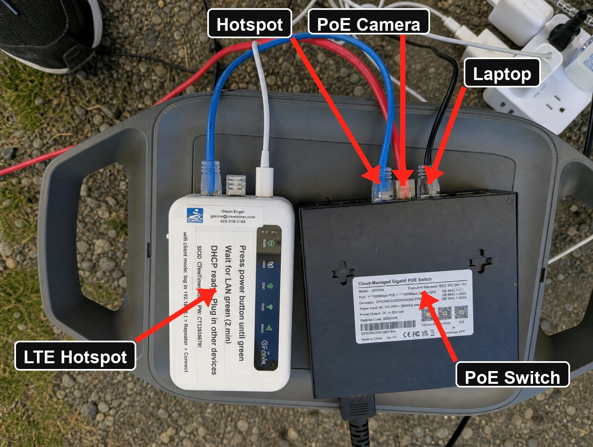
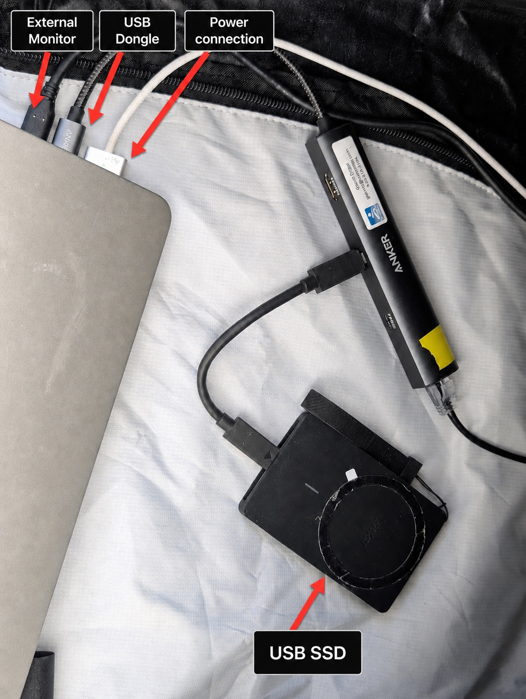

# Example Video Setup and Configuration

The following shows configuring a Macbook to act as video recorder and video review.  It uses these key items:

* PoE Camera - AIDA UHD-NDI3-X30
* LTE Hotspot
* PoE Switch
* USB Dongle on laptop
* Optional second monitor
* 3-axis camera mount
* Camera rail

## Step by Step

See the following diagram and details for hooking up the video camera and computer.

1. Connect Hotspot to power.  If the green power led is not on, press the power button on the side until it lights up.
2. **Wait for the WiFi and LTE lights to turn green before hooking anything else up.**
3. Connect the Hotspot to the PoE switch with a network cable.
4. **After the hotspot has Internet**, plug in the PoE Camera to the PoE switch. 
5. Connect power and USB dongle to laptop.  The USB Dongle should be on the high speed port, usually closest to the rear of the laptop.
6. Ensure the WiFi on the laptop is turned off.  It will get it's Internet connection via cable.
7. Connect an Ethernet cable from the PoE switch to the computer dongle.
8. Connect external SSD Drive for recording
9. If using a second monitor, it should be connected directly via USB or HDMI on the dongle

### Recorder Tips

* Select the camera from the drop-down.  It should start showing video.  If not found check wiring connections and restart camera by unplugging and plugging back in.
* Click the folder icon to select the recording folder.  This folder must match the video review app.
* Camera settings are available using the gear icon on the left nav panel.  Start by maximizing and centering the crop zone.
* Toggle shutter speed and f-stop up and down to tweak exposure.  Target at least 1/1000 shutter speed and f8 or more.
* Start recording by pressing the Start button at top of screen.

### Network Cabling

### Laptop Dongle Connections

## Video Camera Alignment

It is helpful to mount a rod on top of the camera.  This can be used as a finish guide for clicker operators stationed behind the camera as well as an alignment tool where a wire and far marker are used.

Two cases are possible:

### Basic Setup

1. Level camera tripod and align camera by sight to finish line and guide wire if present.  Use a vertical rod mounted to top of camera to get close.
2. Level the camera side to side by using the 3 axis control.  Tilt camera down or up toward the finish line.
3. Using recording video, select the settings side nav option, adjust the camera shutter speed and aperature.  **Shutter speed should be 1/1000 or faster and aperature should be f8 or more.**  Use gain if more light is needed.

### Alignment with a guide wire

1. Using the recording video, zoom in so the far marker is visible as well as the guide wire.  Adjust focus as necessary.
2. Move the tripod itself or a camera rail crank if present to align the guide wire and far marker so they overlap.  **This does not involve a 3-axis control.**
3. Adjust camera angle with 3-axis control so the virtual finish line on the recording preview is on top of the far marker.  The wire should also stay on top of the far marker for this step.
4. Adjust vertical tilt and zoom to maximize the area of the display for recording the finish line.

### Alignment without a guide wire

In this scenario the camera tripod is placed 'best effort' to be on the finish line pointing toward the far finish marker.  If camera is in front of manual timers, a vertical rod mounted to the top of the camera can be used by timers to establish a timing line.

1. Using the recording video, zoom in so the far marker is visible as well as the guide wire.  Adjust focus as necessary.
2. Adjust camera angle with 3-axis control so the virtual finish line on the recording is on top of the far marker.  The wire should also stay on top of the far marker for this step.
3. Adjust vertical tilt and zoom to maximize the area of the display for recording the finish line.

## Laptop considerations

* Disable WiFi or it may not communicate well with the PoE Camera on the wired network due to wired having a higher priority.
* Disable updates so bandwidth is not consumed
* Note that the rear USB connection is usually the highest bandwidth so should receive the dongle.
* On macos you can run `caffienate -s' to keep the laptop from sleeping

## Other configurations

If your source of Internet is WiFi, see [Internet Connection Sharing](./VideoRecorder.md/#internet-connection-sharing) for instructions on how to share the WiFi connection with the wired connection.
