# Video processing with CrewTimer Video Review

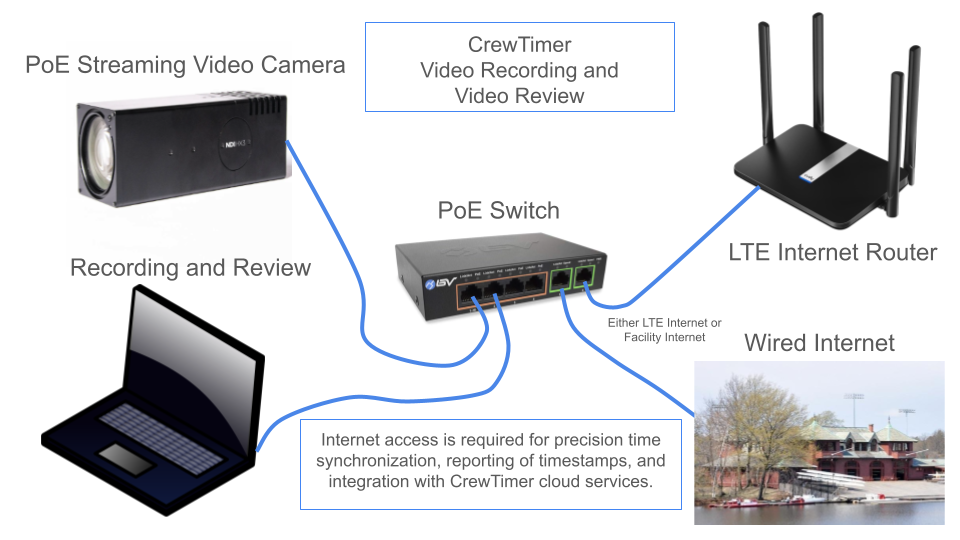

## Introduction

The *CrewTimer Video Review* application provides the ability to process finish line recordings in a format created by [CrewTimer Recorder](https://admin.crewtimer.com/help/VideoRecorder) or RiaB Camera. These recordings combine video and timestamps for accurate evaluation of the finish times.

CrewTimer Video Review makes processing the results highly efficient by integrating "hints" from other CrewTimer stations into the workflow.

It is strongly recommended to test the full suite of hardware and software before your actual regatta. Although the overall process is not complicated, it is more involved then operating a clicker or Add Split button on the CrewTimer Mobile App.

The *CrewTimer Recorder* application utilizes NDI streaming cameras while the *RiaB Camera* application uses Basler machine vision cameras.  These applications record a series of mp4 files providing continuous coverage with no gaps. Each mp4 file is timeboxed to a specific time period and has embedded  timestamps for each video frame.  When used in conjunction with the *CrewTimer Video Review* application, the operator is able to easly access all video for the regatta for use in determining finish order quickly as well as to determine accurate timing.

## Getting started

You will need to download and install the CrewTimer Video Review software from the [Downloads Page](https://admin.crewtimer.com/help/Downloads). These links will always take you to the latest version available. It is recommended that you always update the software to the latest version as part of the preparation for your regatta.

You can determine the current version you are running by clicking the three lines at the top right of the application window and selecting *About*. A window will show you the current version.

## Configuration

There are a few setups steps to complete before you can process results. You will need to complete these steps before each regatta.

Firstly, you will need the regattas **MobileID** and **MobilePIN** from the CrewTimer admin website.

### Associating with the correct CrewTimer regatta

If you are familiar with the CrewTimer Mobile App, this is going to be very familiar.

Before you can complete the next steps, work with your CrewTimer regatta administrator to get the MobileID and MobilePIN. Also make sure that you have both **Finish** and **Finish2** "WAYPOINTS" setup in the regatta. This screenshot shows what it would look like in the [CrewTimer Admin Portal](https://admin.crewtimer.com/):

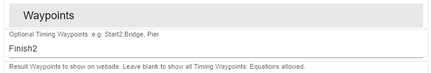

CrewTimer Video Review works the same way as any other timing station. Using both **Finish** and **Finish2** names provides some additional functionality for review in the admin portal.

If you are confident about your video setup, it's recommended that the video system is your primary (most accurate) source of timing.

- [ ] Select the "CrewTimer Settings" tab in the main Connect window (the rower icon)
- [ ] Enter your MobileID and MobilePin for the regatta

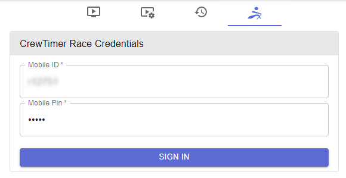

- [ ] Press the "SIGN IN" button (a stable internet connection is an important requirement)

If all goes well you should see the name of the regatta and a green checkbox appear to indicate you have properly logged into the regatta.

You will now be able to test the final two settings here:

- [ ] The "Timing Waypoint Selection" is where the video scoring will publish its results. As mentioned earlier, the video station should be your most accurate station and probably be assigned the "Finish" Waypoint.
- [ ] The "Timing Hint Waypoint" is a fantastic feature which will help you locate crews crossing the line much faster. If another volunteer is using CrewTimer with station "Finish2", select that station from the dropdown. You will see later in this manual how beneficial is it (but not required!).

Your setting will likely look like the below:

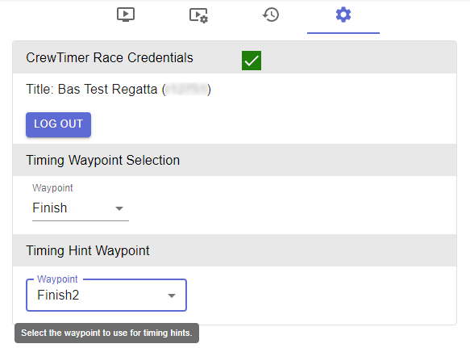

### Other setup

You have a few other options to review that can help you process your results faster.  These are found on the Video Settings tab (the playback + gear icon, the second from the left).

| Course Configuration | Description |
| --- | --- |
| Course Timezone | If you are reviewing the video in a different timezone than where the regatta is, you can set the "Course Timezone" to where the event is taking place. This will ensure that timestamps are shown in the local timezone for where the event takes place. This is very convenient when you are looking at the times on a race schedule or heat sheet.|
| Lane is Below Guide Line | Check if lane 1 is on the far side of the course. |
| Travel Right to Left | Check if boats move right to left on the video. |

| Interface Settings | Description |
| --- | --- |
| Hyperzoom Resolution | Sets the time resolution used when video is zoomed. Select *Native Video* to disable Hyperzoom. Hypezoom uses video processing to calculate the speed of objects and extrapolate their position between video frames. |
| Invert wheel  direction| Allows adjusting the behavior of the scroll wheel to your preference. |
| Mouse Wheel Factor | Adjusts the sensitivity of the mouse wheel in relation to frame scrolling. Higher numbers provide finer control if you are seeing multi-frame jumps for each wheel click. Adjust this to fit your workflow.  For windows, 100 seems to work well while on MacOS, 4 works well. |

| Guide Visibility | Description |
| --- | --- |
| Finish | Check to show a finish line over the video. The *Reset Finish* button will reset the finish position to the center of the video.|
| Lane X | Check to show invidual horizontal lane guides. The advanced features section covers it's use.|

Your setting will look like the below for an 8 lane course.

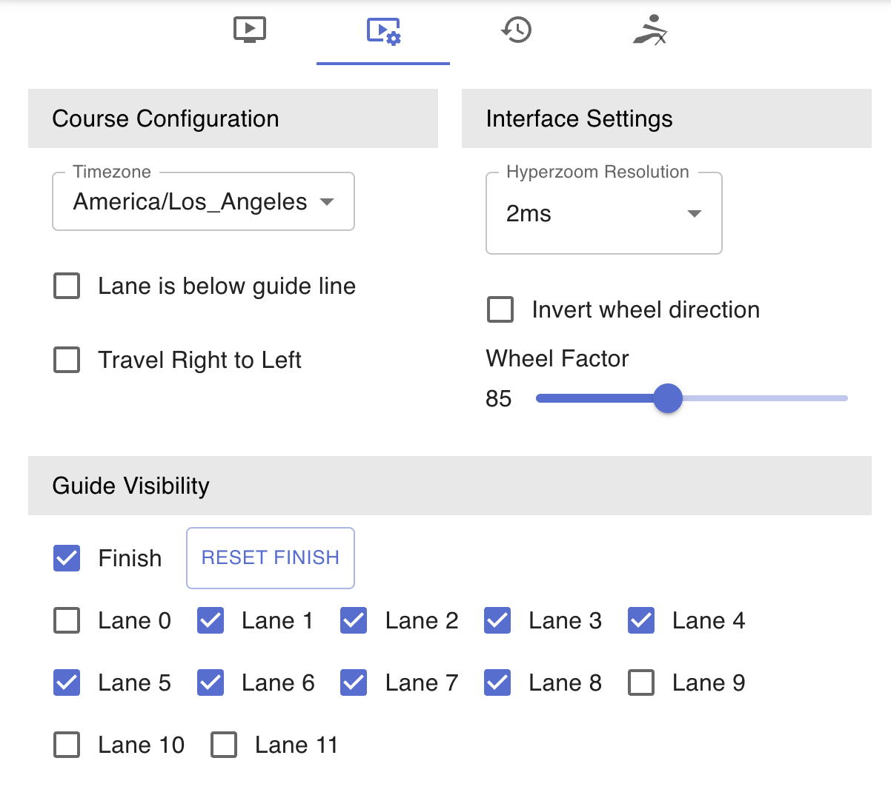

### Selecting the video directory

Before you can use the video review features, you need to let the software know where the video files can be found. The software will monitor this directory for any new files. When a new file is generated by the capture software, the file will automatically be added to the file list.

- [ ] Select the "Video Review" tab in the main window (the leftmost icon)
- [ ] Select the "CHOOSE FOLDER" button in the top right corner of the interface

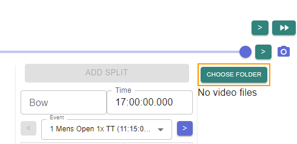

- [ ] In the folder explorer that now opens, browse to the directory that will contain the video file

Your UI will now update with any files that exist in the directory you selected. It's fine if there is no files yet.

## Using the software

We will start with an overview of the main User Interface to get you familiar:

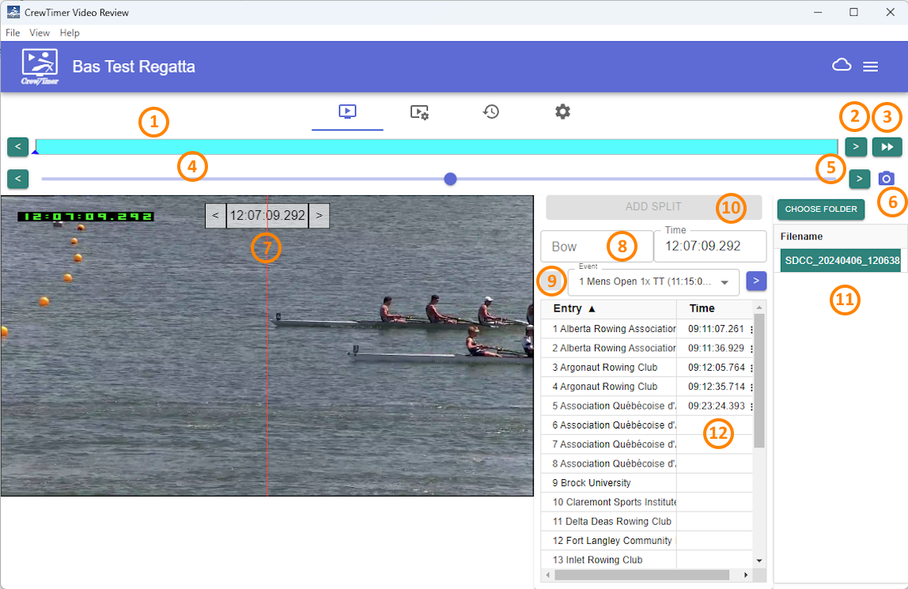

1. Video Timeline
2. Previous | Next File
3. Jump to end | Split Video
4. Video Scrub
5. Previous | Next Frame
6. Save Screenshot
7. Timestamp | Previous | Next Frame
8. Assign Bow
9. Select Event
10. Assign Split
11. File Selector
12. Assigned Timestamps

### (1) Video Timeline

This bar will show all the different capture files present in your chosen folder. Note that you should not have files from previous days in the same directory to avoid conflicts with timestamp names in the filenames. The currently active video is shown in blue. Other files are green. You can click on any of the "blocks" to jump to that file.

Note that this is also where you will see any (orange) markers from the CrewTimer Station you picked for your "Hints":

### (2) Previous | Next File

Instead of using your mouse to select the file of interest, you can click the single arrow on the left and right side of the video timeline. This is another way to navigate the timeline.

### (3) Jump to end | Split Video

This double arrow button jumps to the last file in the video directory. If you are in the same network as the capture software this button might also do two other things:

- Start the recorder software if it was not running
- Ask the recorder software to start a new file

This is very helpful in the normal finishline workflow. As you see boats approaching, generate a new file. This will allow you to later remove blank video files and make review faster.

### (4) Video Scrub

The blue dot can be selected with the mouse and dragged left and right. Or, you can click the left mouse button on a position on the timeline to jump there. This is your primary method for quick navigation within a video file.

Note that when your current video file has CrewTimer hints, they will also show here:

Clicking on one of the markers will be the fastest way to locate areas of interest.

If the CrewTimer station using the mobile app already assigned the split, ***CrewTimer Video Review*** will pre-populate the Bow and Event for you!

**Note: Make very sure in your review that you agree with the Bow number selection.**

### (5) Previous | Next Frame

Much like the similar buttons in the video timeline, these buttons allow you to move by a single frame within the selected video. This is typically used to narrow down the exact moment the bow crosses the line.

### (6) Save Screenshot

If your umpires or maybe the media team wants to document a particularly close finish. The "Save Screenshot" button can be used to make a copy of the active video frame.

### (7) Timestamp

This panel show the timestamp associated with the current video frame. This is the timestamp used to populate the result when you hit the "ADD SPLIT" button.

If the timestamp has been computed utilizing Hyperzoom, an hourglass icon shows up next to the timestamp.

### (8) Assign Bow

This is where you enter the bow number. You can do this several ways:

- [ ] Enter the bow number into the field directly
- [ ] Click the "ENTRY" for the bow number in the event list
- [ ] Click on the video between lane guides (if using lane guides)

#### (9) Select Event

You select the event that you want to score from the dropdown or move to the previous or next event with the arrows to the side.

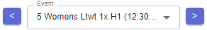

### (10) Assign Split

To assign a split there are three things that need to be set:

- [ ] Make sure you have selected the frame that best reflects the time the boat crossed the finish line
- [ ] Make sure the correct event is selected
- [ ] Enter the "BOW" number for the boat you are scoring or click on the screen between lane guides
- [ ] Press the "ADD SPLIT" button

As soon as you do this, it will be reflected on the CrewTimer website, like any other CrewTimer timing signal.

Please note that "EVENT" and "BOW" might have been pre-populated when you clicked the marker in the timeline.

### (11) File Selector

Another way to select the file you want to look at, is by selecting it from the file list. This can be useful if you have the time in the filename and you want to quickly jump to a given time.

The more common use is to delete files without any finishes from there. It's common that you have recordings from periods without finishes, for review and data storage considerations, it's recommended to delete them whenever there is some time available. Deleting a file is straight forward:

- [ ] Review the "VIDEO TIMELINE" for any files that do now show any results
- [ ] Select the segment in the "VIDEO TIMELINE", this will highlight the video in the "FILE SELECTOR"
- [ ] Right click the mouse button on the file in question (the file should be highlighted) and select "DELETE"

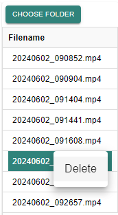

- [ ] Confirm the delete action if you are sure this the file you want to remove

### (12) Assigned Timestamps

After you start scoring races, your assigned times will start to show here.

If you want to remove a timestamp, click on the triple dot and select "DELETE":

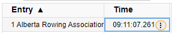

You will be asked to confirm that you want to delete this timestamp:

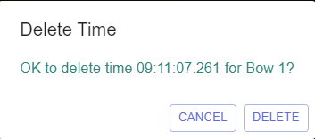

#### Jumping to scored entries

By clicking an already scored entry in the event list, the software will open the exact time in the video for the entry. This can be be very useful in facilitating close finish reviews after a race completed.

#### Sorting by finish time

This can be done in the CrewTimer admin portal as well. But a quick way to review the recorded finish order with the umpire is to click on the small triangle next to "ENTRY". Clicking there will switch between sorting by BOW and sorting by TIME:

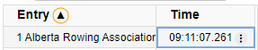

### Advanced Features

#### Keyboard Shortcuts

A number of keyboard shortcuts are available to speed up scoring.

| Key | Function |
| --- | --- |
| <, comma, left-arrow | Move the video one frame when fullscreen.  Move the video according to the Hyperzoom resolution while zooming. |
| >, period, right-arrow | Move the video one frame when fullscreen.  Move the video according to the Hyperzoom resolution while zooming. |
| Right Click | Press the *Add Split* button. |
| Left Click | Zoom the video centered on the point of interest under the finish line. |
| Mouse Wheel rotate | Move the video one frame when fullscreen. Move the video according to the Hyperzoom resolution while zooming. |
| Drag left or right | When zooming, moves the video left or right |
| Drag up and down | Adjust the video zoom factor |
| Spacebar | Trigger companion video recorder to close current mp4 file and start a new one. |

#### Zoom

When reviewing the video it can be helpful to zoom into the bow ball of a boat. This is done by placing the mouse cursor on the point of interest, pressing the left mouse button and dragging the mouse down. This can be repeated a few time to achieve the desired amount of zoom:

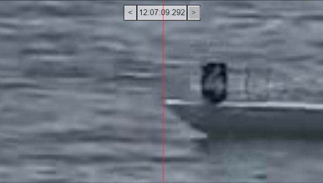

You can reduce the amount of zoom, the steps are the same, but the mouse is dragged up.

To fully reset the zoom, double-click anywhere in the image or select another point in the timeline.

#### Hyperzoom

Hypezoom uses video processing to calculate the speed of objects and extrapolate their position between video frames.

While the image is zoomed, dragging the mouse left and right moves the video in finer resolution than the native video resolution.  The movement resolution is controlled by the *Hyperzoom Resolution* setting.

#### Moving the finish line

It's best practice to ensure the center line of the camera is exactly on the finish line, and pointed exactly at the finish marker at the far side of the course.

If this is not possible, CrewTimer Video Review allow you to move the finish line marker. When you move your mouse close to the top of the finish line, you will see a small white box appear on both ends of the line.

When you drag the top marker, the line moves in it's entirety. When you move the bottom marker, only the bottom end moves. This allow you to angle the finish line:

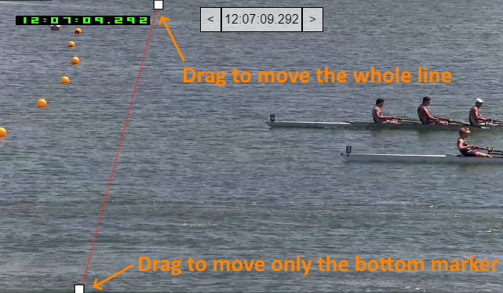

To undo any introduced angle, press and hold SHIFT while moving either marker.

To bring the finish line back to the center and undo any angle, go back into the "Video Settings" and press the "RESET FINISH" button.

#### Interpolated finish times

**Note: with the additon of Hyperzoom, this features is deprecated and may be removed in the future.  Hyperzoom is much easier and quicker to use.**

**Note you should discuss this approach with your Chief Judge at the Finish to ensure they are OK with these calculations.**

Because boats move at fairly constant speed, times from two different video frames can be used to calculate a finish time. This is useful when two boats finish very closely (and the exact time is critical) and no single frame provides a view of the bow crossing the line exactly. This is done by following these steps:

- [ ] Find the last video frame before the bow crosses the line
- [ ] Press and hold SHIFT and click on the location of the bow ball. A blue line will appear
- [ ] Move to the next video frame where the bow crossed the line
- [ ] Press and hold SHIFT and click on the location of the bow ball. A blue line will appear

After doing this, the calculated time will show below the video timestamp. In the example below, you can see the frame before the video has a timestamp of *12:07:09.292*, followed by *12:07:09.308*. The calculated timestamp is *12:07:09.300* and will be assigned when you press the "ADD SPLIT" button

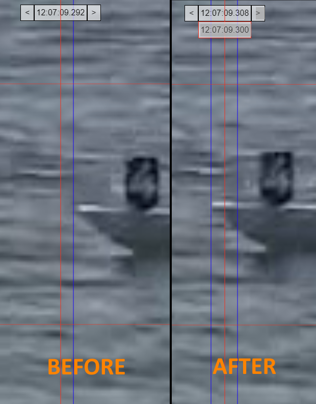

Double clicking the image will reset the blue lines.

#### Using lane guides

The software allows you to place lane guides. When you click between the lane guides, the software will populate the bow number based on the information you provided.

When lane guides are enabled, they can be adjusted in a manner similar to the finish guide by clicking and dragging the end points:

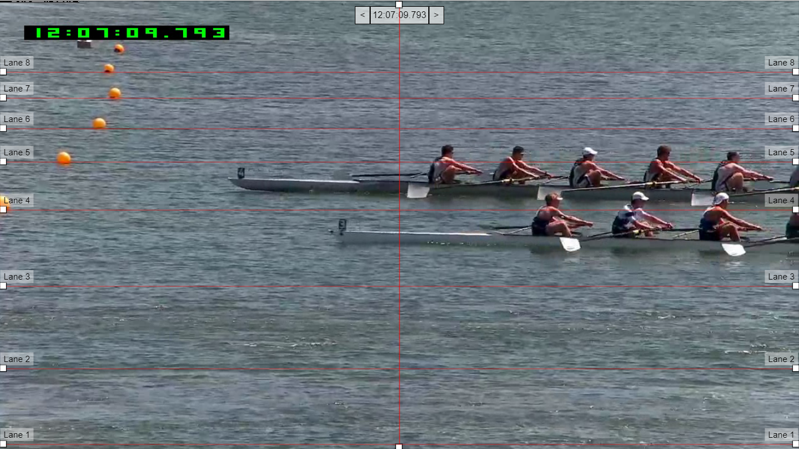

Visibility of lane guides is configured in the "Video Settings" tab. See the "Other Setup" section earlier in this document.

## Suggested Equipment

Please visit the [Suggested Equipment Page](https://crewtimer.com/help/Equipment) for various options.
