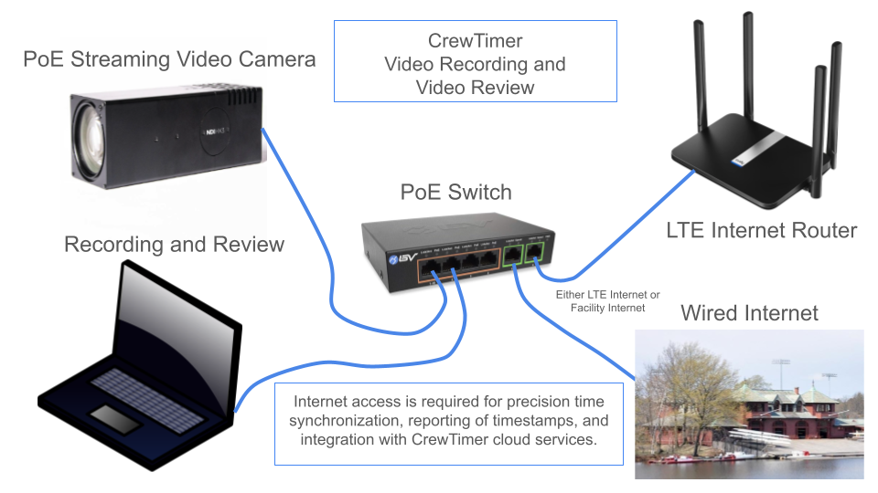
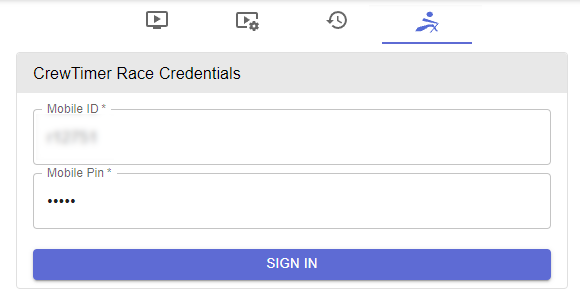
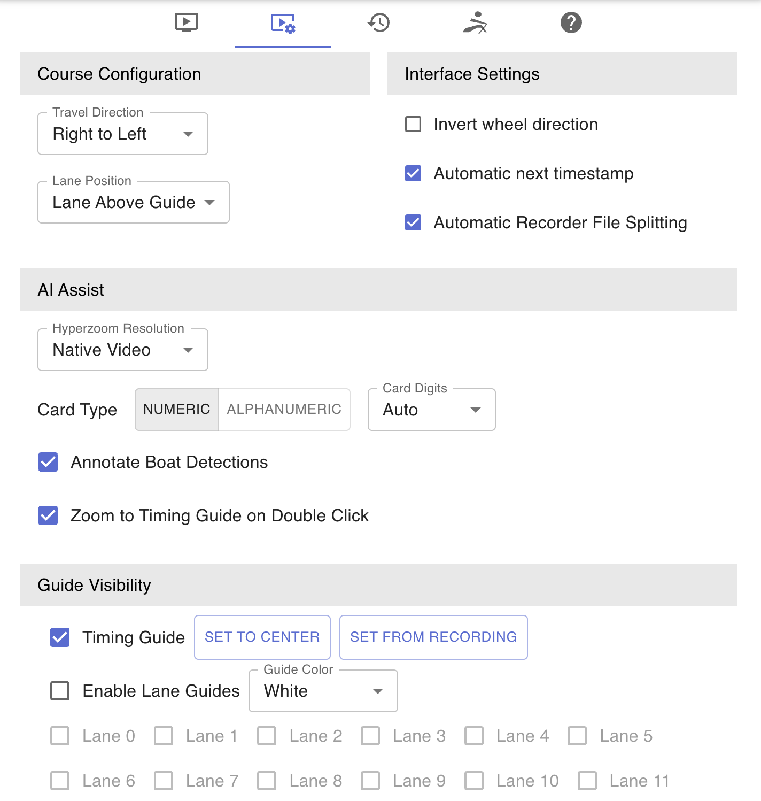
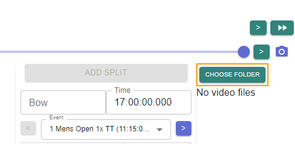
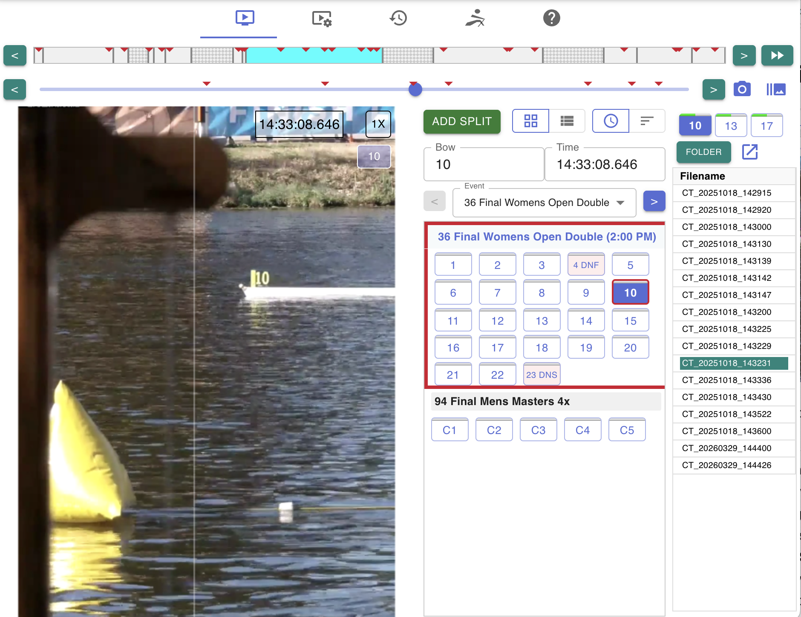
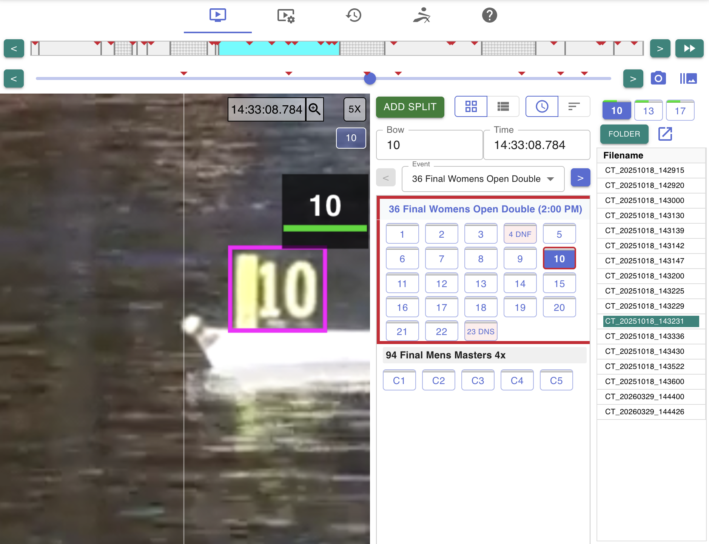
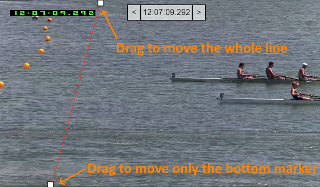
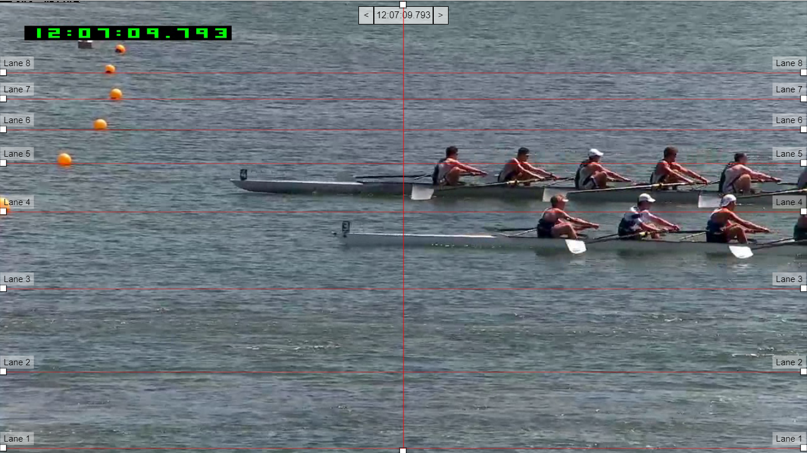

# Reviewing video with CrewTimer Video Review

## Introduction

CrewTimer Video Review processes start, finish, and intermediate-waypoint recordings made by [CrewTimer Recorder](https://admin.crewtimer.com/help/VideoRecorder) or RiaB Camera. The recordings contain frame timestamps, allowing an operator to identify the exact crossing time and publish it directly to CrewTimer.

The application can also display timing hints from other CrewTimer stations. Hints make it much faster to find each crossing, but the video operator must still verify the event, bow, and crossing frame before publishing a time.

Test the complete camera, recorder, network, and review workflow before the regatta. Video review is straightforward after practice, but it involves more setup and judgment than operating a clicker or using **Add Split** in the CrewTimer Mobile App.

Watch the [CrewTimer Video Review training videos](https://www.youtube.com/playlist?list=PLSIPH6-6DDtDjL5tFoddhv9D5MfUjvS0b) for guided demonstrations of the review workflow.

## Table of contents

- [Reviewing video with CrewTimer Video Review](#reviewing-video-with-crewtimer-video-review)
  - [Introduction](#introduction)
  - [Table of contents](#table-of-contents)
  - [Install and update](#install-and-update)
  - [Testing with demo regatta](#testing-with-demo-regatta)
  - [Connect to the regatta](#connect-to-the-regatta)
    - [Waypoint choices](#waypoint-choices)
  - [Configure video review](#configure-video-review)
    - [Course configuration](#course-configuration)
    - [Interface settings](#interface-settings)
    - [AI Assist](#ai-assist)
    - [Guide visibility](#guide-visibility)
  - [Select the recording folder](#select-the-recording-folder)
  - [Main review workflow](#main-review-workflow)
    - [Timeline and hints](#timeline-and-hints)
    - [Scrub and frame navigation](#scrub-and-frame-navigation)
    - [Select an event and bow](#select-an-event-and-bow)
    - [Add or replace a split](#add-or-replace-a-split)
    - [Review, seek, and delete times](#review-seek-and-delete-times)
    - [File list and recording cleanup](#file-list-and-recording-cleanup)
  - [Zoom and crossing alignment](#zoom-and-crossing-alignment)
    - [Normal zoom](#normal-zoom)
    - [Automatic zoom to the timing guide](#automatic-zoom-to-the-timing-guide)
    - [Hyperzoom](#hyperzoom)
    - [Move the timing guide](#move-the-timing-guide)
    - [Lane guides](#lane-guides)
  - [Keyboard and mouse reference](#keyboard-and-mouse-reference)
  - [Screenshots and image archives](#screenshots-and-image-archives)
  - [Suggested equipment](#suggested-equipment)

## Install and update

Download CrewTimer Video Review from the [CrewTimer Downloads page](https://admin.crewtimer.com/help/Downloads). Install the latest version before each regatta.

To check the installed version, open the menu at the upper right and select **About**.

An introductory video is also available on [YouTube](https://youtu.be/rMzJ9kCMo-Y). The interface has evolved since that video was recorded, so use this document for current control names and behavior.

## Testing with demo regatta

Use the CrewTimer demonstration regatta to practice the complete review workflow without affecting a live regatta:

1. Download and install the latest [CrewTimer Video Review release](https://github.com/crewtimer/crewtimer-video-review/releases/latest).
2. Open the **CrewTimer Settings** tab.
3. Sign in with Mobile ID **r16305** and Mobile PIN **22809**.
4. Set **Waypoint** to **FinishCam**.
5. Set **Hint Waypoint** to **Finish**.
6. Download [VideoReviewTutorial.zip](https://storage.googleapis.com/resources.crewtimer.com/DemoData/VideoReviewTutorial.zip) and extract it to a local folder.
7. Open the **Video Review** tab, select **Folder**, and choose the extracted video folder.

The demo regatta is reset every 30 minutes, on the hour and half hour. Any timing data you add may therefore disappear at the next reset. The supplied video files remain on your computer and can be reused after each reset.

Watch the [CrewTimer Video Review Tutorial](https://www.youtube.com/playlist?list=PLSIPH6-6DDtDjL5tFoddhv9D5MfUjvS0b) which uses the demo regatta.

## Connect to the regatta

Obtain the regatta's **Mobile ID** and **Mobile PIN** from the regatta administrator.

1. Open the **CrewTimer Settings** tab (rower icon).
2. Enter the Mobile ID and Mobile PIN.
3. Select **Sign In**.
4. Confirm that the regatta title and green check mark appear.
5. If the regatta spans multiple configured days, select the correct **Day**.
6. Select the **Waypoint** where reviewed times will be published.
7. Select a **Hint Waypoint**, if available.
8. Optionally select a **Second Hint Waypoint**.

### Waypoint choices

- **Waypoint** is the station to which Video Review publishes times. Use the waypoint designated by the regatta administrator.
- **Hint Waypoint** supplies the primary clicker or timing markers shown in Video Review.
- **Second Hint Waypoint** is a fallback used when you double-click an entry that has no reviewed camera time or primary hint time.
- **Day** filters the events shown in Video Review when the regatta uses CrewTimer's multi-day configuration.

The video system is normally the most accurate timing source. A common arrangement is to publish video times to one finish waypoint and use a separate clicker waypoint for hints. The exact waypoint names are regatta-specific; they do not have to be `Finish` and `Finish2`.

## Configure video review

Open the **Video Settings** tab (playback-and-gear icon).

### Course configuration

| Setting | Operation |
| --- | --- |
| **Travel Direction** | Select **Left to Right** or **Right to Left** to match boats as displayed in the recording. This also determines the logical forward and backward jog direction. |
| **Lane Position** | Select whether each lane is above or below its lane guide. This is used when selecting a bow by lane. |

### Interface settings

| Setting | Operation |
| --- | --- |
| **Invert wheel direction** | Reverses mouse-wheel frame navigation. |
| **Automatic next timestamp** | After a split is recorded, advances to the next unprocessed timing hint. If AI zoom is enabled, the application also attempts to locate that boat at the timing guide. |
| **Automatic Recorder File Splitting** | Requests recorder file splits based on incoming timing activity. Use this only when Video Review can communicate with the recorder. A new timing hint re-arms automatic requests. |

### AI Assist

| Setting | Operation |
| --- | --- |
| **Hyperzoom Resolution** | Selects the timestamp step used while zoomed. **Native Video** disables interpolated sub-frame movement; 10 ms through 1 ms enable progressively finer interpolation. |
| **Card Type: Numeric** | Uses OCR optimized for numeric bow cards. |
| **Card Type: Alphanumeric** | Uses OCR that accepts a single letter prefix followed by digits. **Card Digits** is disabled in this mode. |
| **Card Digits** | Limits numeric OCR to the selected number of trailing digits. With **Auto**, an event containing only one-digit numeric endings uses one digit; an event containing two-digit endings uses two. Otherwise automatic/default behavior is retained. |
| **Annotate Boat Detections** | Draws detected boats, bow-card boxes, recognized bow values, and confidence on the video. Click a recognized bow label to select it. |
| **Zoom to Timing Guide on Double Click** | On an unzoomed double-click, detects the nearby boat and seeks to its estimated crossing of the timing guide. If detection fails, normal 5x zoom is used. |

AI recognition is an aid, not the official result. Always verify the bow and crossing frame before adding a split.

### Guide visibility

| Setting | Operation |
| --- | --- |
| **Timing Guide** | Shows or hides the line used to judge the crossing. |
| **Set to Center** | Restores the timing guide to the center of the video. |
| **Set from Recording** | Restores the guide position saved by the recorder in the recording metadata. |
| **Enable Lane Guides** | Enables lane guides and their individual visibility controls. |
| **Guide Color** | Changes the color of the timing and lane guides for better contrast. |
| **Lane 0–11** | Shows or hides individual lane guides. |

Settings for guide positions are saved with the video sidecar information.

## Select the recording folder

1. Open the **Video Review** tab (video icon).
2. Select **Folder** above the file list.
3. Choose the directory containing the recording files.

The button beside **Folder** opens the selected directory in the system file explorer. Video Review monitors the directory and adds new recording files as they appear. Keep recordings from different regatta days in separate directories when practical.

## Main review workflow

A reliable workflow for every crossing is:

1. Find the crossing using a timing hint, the timeline, the file list, or the event entry.
2. Select the event and bow.
3. Zoom or jog until the bow reaches the timing guide.
4. Verify the displayed timestamp, event, and bow.
5. Select **Add Split**, or right-click the video.
6. Confirm any warning about replacing a time or using a bow not found in the schedule.

The split is saved locally and published to the selected CrewTimer waypoint. If **Automatic next timestamp** is enabled, Video Review then advances to the next unprocessed hint.

### Timeline and hints

The upper timeline represents all recordings in the selected directory. Select a file segment to open it, or use the **<** and **>** buttons to move to the previous or next file.

Hint and scored-time markers appear above or below the timeline. Select a marker to seek to its timestamp. When a hint includes a known event and bow, Video Review also selects them. Markers outside the currently recorded time range may still be shown so the operator can recognize missing video coverage. Cross-hatched rectangles represent recording files that contain no timing data.

The fast-forward button at the right requests the recorder to close its current file and begin another. The spacebar performs the same action. It does not simply jump to the last local file.

### Scrub and frame navigation

Use the file scrubber to move quickly within the active recording. For precise positioning, use the previous/next-frame controls, the mouse wheel, or the left and right arrow keys. When zoomed and Hyperzoom is enabled, these controls can move by sub-frame timestamp increments.

The timestamp displayed for the current image is the value recorded by **Add Split**. An hourglass indicator means the image and timestamp were produced by Hyperzoom interpolation.

### Select an event and bow

Select the event from the **Event** list or use its previous and next buttons. Events are filtered by the selected day. Combined races configured in CrewTimer display their entries together.

Select a bow in any of these ways:

- select its entry in the event list or grid;
- enter or select the bow in the scoring controls;
- select an available nearby hint button;
- click a recognized label when detection annotations are enabled; or
- click the appropriate area between configured lane guides.

Unknown or nearby unprocessed hints are displayed as buttons above the file list. Selecting one seeks to its time and carries over any known event or bow.

Never assume that a hint or OCR result is correct. Compare it with the visible bow card and event schedule.

### Add or replace a split

Select **Add Split** or right-click the video after the crossing frame, event, and bow have been verified.

- A bow and event are required.
- If the bow is not in the selected event, Video Review asks whether to add it anyway.
- If a time already exists for that bow, Video Review asks whether to replace it.
- Rapid duplicate actions are ignored to reduce accidental double submissions.

### Review, seek, and delete times

Recorded times appear beside the entries in the timing sidebar and in **Timing History**.

- Select an entry to make its event and bow active.
- Double-click a scored entry to seek to its recorded camera time.
- If it has no camera time, double-click seeks to the primary hint, then the secondary hint if configured.
- Right-click a scored entry and select **Delete** to remove its recorded time.

Deleting or replacing a time is published to CrewTimer just like adding one.

### File list and recording cleanup

The file list is another way to open recordings. Filenames include time information, which can help locate a known period. Use the list's context menu for available file operations.

Before deleting any recording, verify that it contains no required crossing and that another copy is not needed. File deletion is separate from deleting a scored CrewTimer timestamp.

## Zoom and crossing alignment

### Normal zoom

Double-click an unzoomed video at the boat's vertical position to enter 5x zoom centered on the timing guide. Double-click again, or press **Z**, **/**, or **Escape**, to leave zoom.

While zoomed, drag horizontally to jog through time. Hold **Shift** and drag vertically to adjust the zoom scale. Holding **Shift** without dragging shows a magnified inspection view when the pointer is away from guide handles.

### Automatic zoom to the timing guide

When **Zoom to Timing Guide on Double Click** is enabled, double-click near a boat. Video Review attempts to track the boat, seek to its crossing, zoom the image, and recognize its bow card. A bow is filled automatically only when recognition meets the application's validation requirements. If automatic tracking cannot produce a result, Video Review falls back to normal zoom.

When reviewing an already recorded entry at its exact saved time, double-click uses normal zoom so the saved crossing is not moved.

### Hyperzoom

Hyperzoom interpolates movement between native video frames. It is useful when a bow crosses the guide between frames. Select the desired resolution in **Video Settings**, enter zoom, then jog or drag horizontally to select the best interpolated position.

Interpolation improves timing resolution but does not add detail that was absent from the source recording. Use the coarsest resolution that clearly resolves the crossing.

### Move the timing guide

When the pointer approaches a guide endpoint, a drag handle appears. Drag the upper timing-guide handle to move the line; drag the lower handle to change its angle. Hold **Shift** while dragging a guide handle to restore vertical or horizontal alignment.

Use **Set to Center** or **Set from Recording** in Video Settings to restore the guide.

### Lane guides

Enable lane guides in Video Settings and select the guides required for the course. Drag their endpoints to match the lanes in the image. The **Lane Position** setting tells Video Review whether the lane lies above or below its guide, and **Travel Direction** determines the crew's direction of motion.

When lane guides are correctly configured, clicking in a lane can select the scheduled bow for that lane.

## Keyboard and mouse reference

| Input | Action |
| --- | --- |
| **Spacebar** | Request a new recording file from CrewTimer Recorder. |
| **Tab** | Seek to the next available timing point or hint. |
| **Left/Right Arrow**, **,/.**, or **</>** | Jog backward or forward according to the configured travel direction. |
| **Mouse wheel** | Jog through video; direction follows the invert-wheel setting. |
| **P** | Start diagnostic/continuous playback. Lowercase **p** starts the alternate playback mode. |
| **Right-click video** | Add the current split. |
| **Single-click detected bow label** | Select the recognized bow. |
| **Double-click video** | Enter zoom or run automatic crossing detection; double-click while zoomed exits zoom. |
| **Z**, **/**, or **Escape** | Exit zoom. |
| **Shift + vertical drag while zoomed** | Adjust zoom scale. |
| **Shift + guide-handle drag** | Restore guide alignment. |
| **Click event entry** | Select its event and bow. |
| **Double-click event entry** | Seek to its camera time or configured hint time. |
| **Right-click scored event entry** | Open the delete menu. |

## Screenshots and image archives

Use the camera control to save the current displayed frame and overlays. Shift-click the camera control to save the raw video frame instead. The application menu also provides archival operations. **Archive Video Files** is available in the normal menu; advanced image-archive and diagnostic items appear when the menu is opened with **Shift** held.

## Suggested equipment

See the [CrewTimer Suggested Equipment page](https://crewtimer.com/help/Equipment) for current hardware options.
