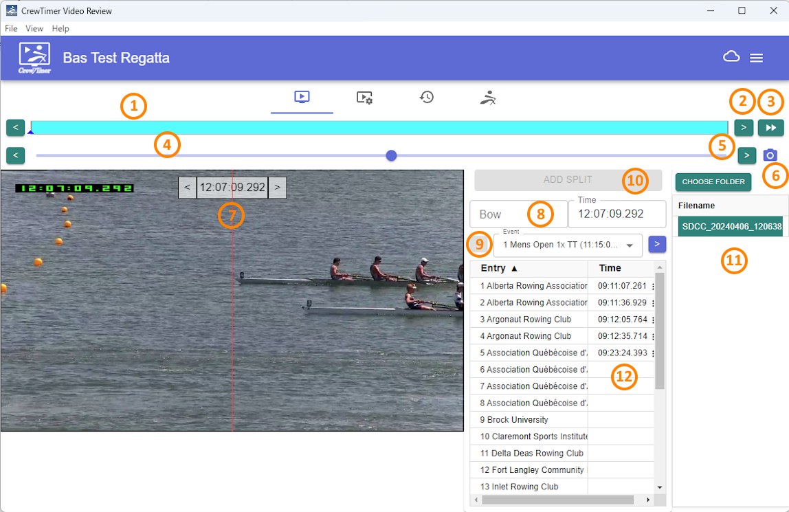

# Video processing with CrewTimer Video Review

## Introduction

The CrewTimer Video Review module provides the ability to process finish line recordings in a format created by CrewTimer Recorder or RiaB Camera. These recordings combine video and timestamps for accurate evaluation of the finishes. 

CrewTimer Video Review makes processing the results highly efficient by integrating "hints" from other CrewTimer stations into the Workflow.

It's strongly recommended to test the full suite of hardware, software and volunteers before your actual regatta. Although the overall process is not complicated, it's more involved then operating a clicker.

## Getting started

You will need to download and installed the CrewTimer Video Review software from here (Windows, Mac). These links will always take you to the latest version available. It's recommended you update the software as part of the preparation for your regatta.

You can determine the current version you are running by clicking the three lines at the top right of your Connect window -> About. A window will show you the current version.

## Configuration

There is a few setups steps to complete before you can process results. You will need to complete these steps before each regatta.

You will need the regattas **MobileID** and **MobilePIN** from the administration website.

### Associating with the correct CrewTimer regatta

If you are familiar with the CrewTimer phone app, this is going to be very familiar. 

- [ ] Select the "SYSTEM CONFIG" tab in the main Connect window
- [ ] Check the "Enable Video Review" option
- [ ] Check the "Integrate with CrewTimer" option

Below is the most common setup, your setup should now look like the below:

Before you can complete the next steps, work with your CrewTimer regatta administrator to get the MobileID and MobilePIN. Also make sure that you have both **Finish** and **Finish2** setup. CrewTimer Video Review works in the same way as any other timing station. But using the **Finish** and **Finish2** names provides some additional functionality for review in the [admin portal](https://admin.crewtimer.com/).

If you are confident about your video setup, it's recommended that the video system is your primary (most accurate) source of timing.

- [ ] Select the "CREWTIMER" tab in the main Connect window
- [ ] Enter your MobileID and MobilePin for the regatta

- [ ] Press the "SIGN IN" button (a stable internet connection is an important requirement)

If all goes well you should see the name of the regatta and a green checkbox appear to indicate you have properly logged into the regatta.

Select the "Waypoint" this station will be populating results for. As mentioned earlier, the video station should be your most accurate station and probably be assigned the "Finish" Waypoint:

### Selecting the video directory

Before you can use the video review features, you need to let the software know where the video files can be found. The software will monitor this directory for any new files. When a new file is generated by the capture software, the file will automatically be added to the file list.

- [ ] Select the "VIDEO" tab in the main Connect window
- [ ] Select the "CHOOSE FOLDER" button in the top right corner of the interface

- [ ] In the folder explorer that now open, browse to the directory that will contain the video file

Your UI will now update with any files that exist in the directory you selected. It's fine if there is no files yet.

### Other setup

You have a few other options to review that can help you process your results faster. 

- [ ] In the top right corner, select the "three lines" icon -> "Video Settings" 

The first things you will want to change is the "Timing Hint Source". This fantastic feature will help you locate crews crossing the line much faster. If another volunteer is using CrewTimer with station "Finish2", select that station from the dropdown :

The default selection of "Visible Panels" is probably fine for most purposes.

If you are reviewing the video in a different timezone then where the regatta is, you can set the "Course Timezone" to where the event is taking place. This will ensure that timestamps are shown in the local timezone for where the event takes place. This is very convenient when you are for example looking at the times on a race schedule or heat sheet.

The remaining options allow you to control whether lane lines are visible in the scoring user interface.

The User Interface section below provides more detail on it's usage.

## Using the software

We will start with an overview of the main User Interface to get you familiar:

1. Video Timeline
2. Previous | Next File
3. Jump to end | Split Video
4. Video Scrub
5. Previous | Next Frame
6. Save Screenshot
7. Timestamp | Previous | Next Frame
8. Assign Split
9. Assign Bow
10. File Selector
11. Assigned Timestamps

### (1) Video Timeline

This bar will show all the different capture files for today. Note that you should not have files from previous days in the same directory. It causes issues with this display. The currently active video is shown in blue. Other files are green. You can click on any of the "blocks" to jump to that file.

Note that this is also where you will see any markers from the CrewTimer Station you picked for your "Hints":

### (2) Previous | Next File

Instead of using your mouse to select the file of interest, you can click the single arrow on the left and right side of the video timeline. This is another way to navigate the timeline.

### (3) Jump to end | Split Video

This double arrow button jumps to the last file in the video directory. If you are in the same network as the capture software this button might do two other things:

- Start the recorder software if it was not running yet
- Ask the recorder software to start a new file

This is very helpful in the normal finishline workflow, as you see boats approaching, generate a new file. This will allow you later to remove blank video files and make review faster.

### (4) Video Scrub

The blue dot can be selected with the mouse and dragged around, or you can left click a position on the timeline with your mouse to jump there. This is your primary method for quick navigation within a video file.

Note that when your current video file has CrewTimer hints, they will also show here:

 

Click on one of those markers will be the fastest way to locate events of interest.

If the CrewTimer station already assigned the split, ***CrewTimer Video Review*** will populate the Bow and Event for you! **Just make very sure in your review that you agree with the Bow number selection**.

### (5) Previous | Next Frame

Much like the similar buttons in the video timeline, these buttons allow you to move by a single frame within the selected video. This is typically used to narrow down the exact moment the bow crosses the line.

### (6) Save Screenshot

If your umpires or maybe the media team wants to document a particularly close finish. The "Save Screenshot" button can be used to make a copy of the active video frame.

### (7) Timestamp | Previous | Next Frame

This panels show the timestamp associated with the current video frame. This is the timestamp used to populate the result when you hit the "ADD SPLIT" button.

The arrow buttons can be used to move between video frames

### (8) Assign Split

To assign a split there is three things that you need to set or check

- [ ] Make sure you have selected the frame that best reflects the time the boat crossed the finish line
- [ ] Make sure the correct event is selected
- [ ] Enter the "BOW" number for the boat you are scoring
- [ ] Press the "ADD SPLIT" button

As soon as you do this, it will be reflected on the CrewTimer website, like any other CrewTimer timing signal.

Please note that "EVENT" and "BOW" might have been pre-populated when you clicked the market in the timeline.

### (9) Assign Bow

This is where you enter the bow number. You can do this in two ways:

- [ ] Enter the bow number into the field directly
- [ ] Click the "ENTRY" for the bow number in the event list

### (10) File Selector

Another way to select the file you want to look at, is by selecting it from the file list. This can be useful if you have the time in the filename and you want to quickly jump to a given time.

The more common use is to delete files without any finishes from there. It's common that you have recordings from periods without finishes, for review and data storage considerations, it's recommended to delete them whenever there is some time available. Deleting a file is straight forward:

- [ ] Review the "VIDEO TIMELINE" for any files that do now show any results
- [ ] Select the segment in the "VIDEO TIMELINE", this highlight the video in the "FILE SELECTOR"
- [ ] Right click on the file in question (it should be highlighted in blue) and select "DELETE"

- [ ] Confirm the delete action if you are sure this the file you want to remove

### (11) Assigned Timestamps

After you start scoring races, your assigned times will start to show in here. You can switch between events by using the dropdown, or move to the next | previous event with the buttons on the side:

If you want to remove a timestamp, click on the triple dot and select "DELETE":

You will be asked to confirm that you want to delete this timestamp:

#### Jumping to scored entries

A very handy feature is the ability to jump to the exact frame of a video for the finish time you recorded. This is handy when you have a set of close finishes that the umpire wants to review. You can keep scoring while the rest of the race finishes. When it's time to show them the playback, you click the timestamp and the video recorded at that moment will open.

#### Sorting by finish time

This can be done in the CrewTimer admin portal as well. But a quick way to review the recorded finish order with the umpire is to click on the small triangle next to "ENTRY". Clicking there will switch between sorting by BOW and sorting by TIME:

